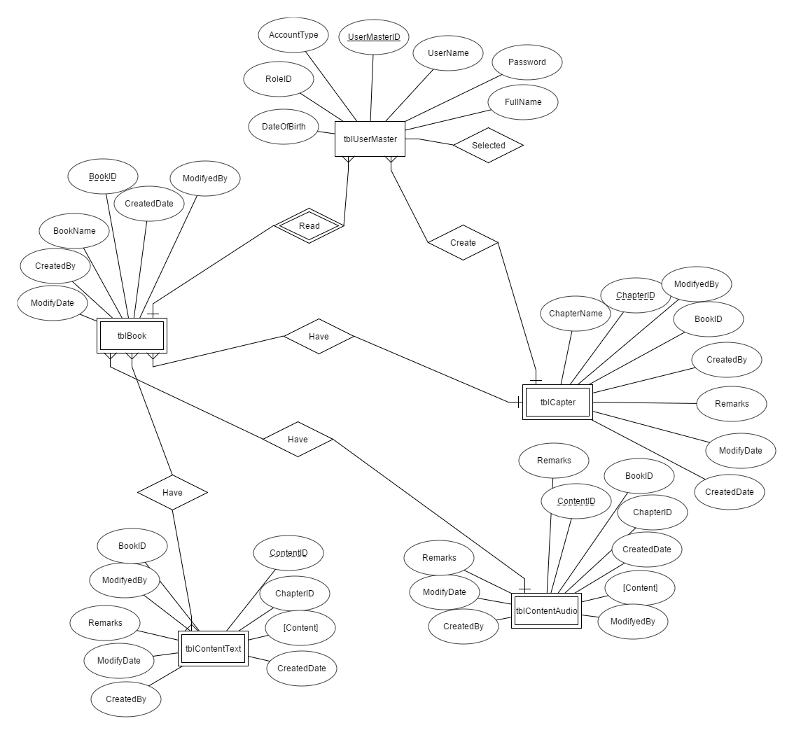
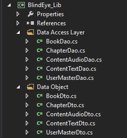
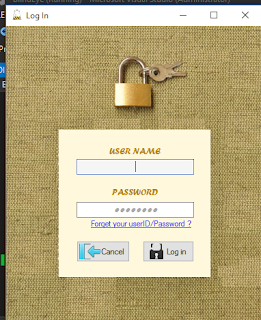
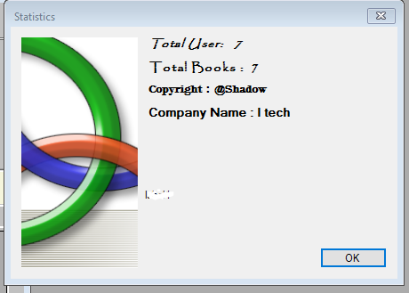
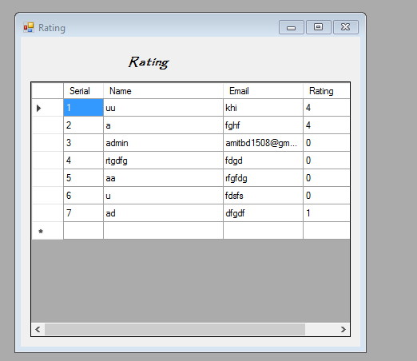
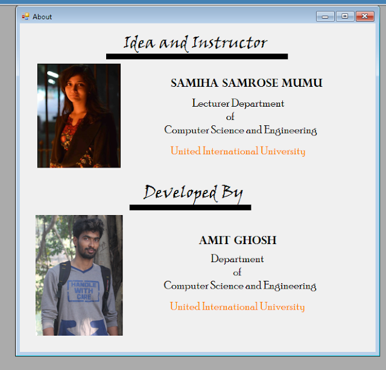

# Blind EYE(Speaker For Blind People)
## A Text reader with voice commend feature for Blind People

### Background
Many People are blind . They cannot read books . For this I develop this software.  Its like an EYE for blind people . It can read book . It can hear your voice commend . I know this is not sufficient and not well polish to use . But its a try for making something for blind. I am pleased to 

#### Advisor
##### Samiha Samrose Mumu

### Feature  
- Voice Control
- Text Reader
- Store any kind of book  (PDF or Text)
- Store Book audio 
- Different type of user login
- Instant Book reader
- Uploader rating

### Development Environment:
- Language:  C Sharp (C#).
- Database Engine:  SQL Server Database Engine.
- IDE: Visual Studio 2015
- Server: Microsoft SQL Server

### Requirement:
- Adobe flash player
- Windows Speech Recognizer 
- .Net framework (4.5 +) 

### ERD

### Project Structure 

### Screenshots

#### Login

#### Main Window

#### User Management

#### Statistics 

#### Rating

#### Book Set-UP

#### Pdf Store

####  Text Store

#### Reader

####  About this Software 

